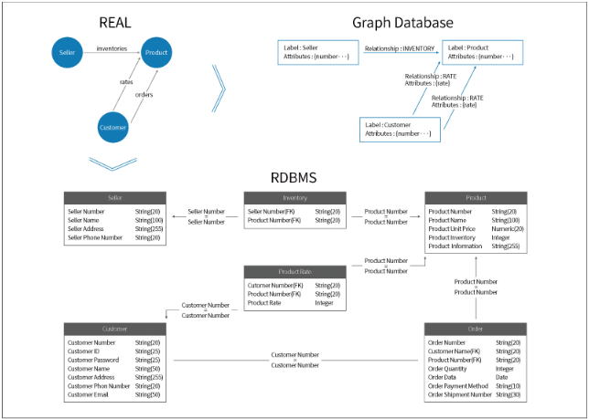
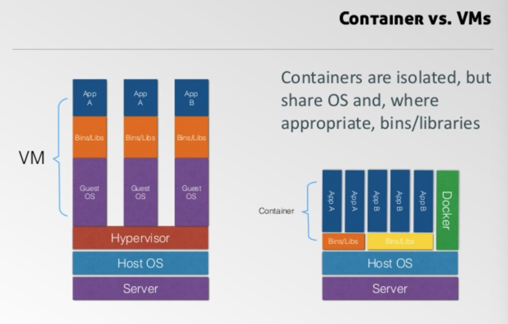

# 해당 파일은 DB공부 내용입니다.

목차  
[1. SQL 기본내용](#SQL_기본내용)  
[2. SQL과 NoSQL 비교](#SQL과_NoSQL_비교)  
[100. Docker 이해하기](#Docker_이해하기)
[101. 일딴 해보면서 익히기 postgresql 실천](#일딴_해보면서_익히기_postgresql_실천)

---

## 1. SQL 기본내용

### 1-1. 기초 내용

> 해당 내용은 **goru99**님의 [What is SQL?](https://www.guru99.com/what-is-sql.html)을 요약한 내용입니다.

    SQL = Structured Query Language

**데이터 베이스**와 대화하기 위해 특별히 디자인된 언어 입니다.

SQL은 크게 두가지로 나눌 수 있습니다.

1. **Relational (SQL)**
2. **Non Relational (NON-SQL)**

SQL의 예시로는 **Mysql, Postgresql, Sqlite**가 있습니다.  
NON-SQL의 예시로는 **MongoDB, DynamoDB, CouchDB**가 있습니다.

SQL의 경우 많은 회사들이 널리 쓰고 있습니다. 주로 회사, 정부기관, 은행 등등 다수 기관들이 SQL을 사용하고 있습니다. 그렇기 때문에 SQL이 **업계 표준**이 된것입니다.

### 1-2. 작동 원리

SQL의 생김새 자체는 엑셀 문서와 똑같습니다. 데이터베이스에는 **테이블**이 존재하고 엑셀에는 비슷한 개념인 **시트**가 있습니다. 각각의 테이블과 시트는 모두 **행**과 **열**이 존재합니다.

행과 열에 각각 아래과 같은 값이 있다고 가정해보겠습니다.  
  
해당 friends라는 이름의 테이블에서 address에 해당하는 값을 모두 가져온다고 한다면 아래와 같이 커맨드를 입력하면 되겠습니다.

```sql
SELECT email FROM friends;
```

커맨드를 보면 바로 알아볼 수 있듯이 전부 영어로 표현이 되있습니다. 그러면 이번엔 학년이 5학년보다 작은 친구의 주소만 불러와 보겠습니다.  


```sql
SELECT email FROM friends WHERE grade < 5;
```

이 커맨드도 똑같이 영어와 거의 유사한 표현방식을 가져서 읽는데 크게 불편한 점이 없습니다.

지우는 개념도 영어를 이용해 매우 간단합니다. value 2번 값에 있는 것을 지워보겠습니다.  


```sql
DELETE FROM friends WHERE id = 2;
```

이번에는 grade의 값에서 2에서 4사이의 값만 들고와 보겠습니다.

```sql
SELECT address
FROM friends
WHERE grade BETWEEN 2 AND 4
```

이는 모두 **SQL의 커맨드**이며 영어와 매우 유사하기 때문에 다루기가 매우 유용합니다.

이렇게 간단한데 수 많은 개발자가 SQL을 건드리지 못하는 이유는 매우 간단합니다. ORM 개념 때문입니다.

### 1-3. ORM 개념

> 해당 내용은 **Bits and Piees**님의 [What is an ORM and Why you should use it](https://blog.bitsrc.io/what-is-an-orm-and-why-you-should-use-it-b2b6f75f5e2a)을 요약한 내용입니다.

ORM이 하는 일을 예로 들면 **파이썬을 가져와서 SQL로 바꿔주는 일**을 합니다. ORM개념 덕분에 **파이썬으로 코딩을 하면 SQL코드**를 얻을 수 있는 것입니다.

그래서 ORM은 정말 자주 쓰입니다. 파이썬의 경우 **장고 ORM**이 있습니다. 라라벨의 경우 **eloquent ORM**, **nodeJS**의 경우 **Sequelize** 혹은 **type ORM**이 있습니다. 이것들은 매우 편하고 간단하게 만들어 줍니다.

**문제**는 개발자들이 너무 **ORM에 의존**한다는 것입니다.

개발자라면 당연하게 파이썬, SQL을 번갈아가며 코딩을 하기보단 한 공간에서 계속 작업을 처리하는 것을 선호할 것입니다. 단점은 ORM에 문제가 생겼을때 혹은 작업을 더 빨리 처리하고 싶을 때 **어떻게 대처해야 할지 모른다는 것**입니다.

그렇기 때문에 ORM에 너무 의존하지 말고 한계점을 왔을 때를 대비해서 SQL을 공부하는 것입니다.

    ORM이 느려졌다거나 문제가 생겼을 때 SQL을 직접 뜯어보면서 대처할 수 있습니다.

---

## 2. SQL과 NoSQL 비교

> 해당 내용은 **Gyoogle**님의 [SQL과 NOSQL의 차이](https://gyoogle.dev/blog/computer-science/data-base/SQL%20&%20NOSQL.html)를 공부한 내용입니다.

### 2-1. NoSQL의 개념

    NoSQL = Not only SQL or Not SQL

No SQL의 뜻이 딱 한가지만의 DB만을 뜻하는 것이 아닙니다. **No SQL**은 **거대한 DB의 그룹**들입니다.

SQL의 예시로는 **MySQL, PostgreSQL, SQLite** 등등이 있다고 얘기했었습니다. 물론 이 SQL들은 각기 다른 특징들을 가지고 있겠지만 결국 **핵심은 SQL**이라는 점에서 같은 것들 입니다.

하지만 반대로 NoSQL은 서로 매우 다른 종류들이 존재합니다. 바로 **Document DB, Key Value DB, GraphDB, Column Family DB** 입니다. 간단한 생김새는 아래 사진을 보겠습니다.  


### 2-1-1. MongoDB의 개념

첫번째 DocumentDB의 가장 큰 예시는 **MongoDB**입니다.
  
MongoDB는 documentDB에서 가장 유명한 종류 중 하나 입니다. 데이터를 json document 형태로 저장하는 형태이고 보통의 SQL처럼 행과 열이 존재하는 것이 아닙니다. 사용자가 원하는 어떤 모양의 데이터든 저장할 수 있는 형태입니다.

평상적인 SQL에서는 데이터의 구조가 상당히 엄격합니다. **유연한 구조가 통하지 않은 형식**이 대부분입니다. 그에 반해 MongoDB는 **데이터가 같은 모양일 필요**가 없을 뿐더러 원하는 **무슨 형태든 저장이 가능**합니다. 아래 간단한 이해를 위한 사진을 보겠습니다.  
  
이것과 같이 확실히 정리된 모습과 자유 분방한 모습으로 비교해 볼 수 있습니다.

### 2-1-2. Key valueDB의 개념

**Key value DB**는 크게 두 가지를 볼 수 있습니다. 첫 번째는 **CassandraDB** 그리고 두 번째는 **DynamoDB**입니다. 여기서 **CassandraDB**는 또한 **column wide DB**이기도 합니다.

**CassandraDB**의 주요한 특징은 읽고, 쓰기가 매우 빠르다는 것입니다. 어느정도 인지 감이 잘 안잡힌다면 **Netflix**가 좋은 예시입니다.  


Netflix와 같은 스티리밍 어플도 **빠른 속도의 처리**를 위해 CassandraDB를 사용하고 있을 뿐만 아니라 지속적으로 업그레이드 시키기 위해 노력하고 있습니다. 그 밖에도 **Instagram, Uber, Apple**과 같은 회사가 채택하고 있습니다.

위 회사들의 공통점은 **엄청 많은 양의 데이터를 빠르게 저장**해야 한다는 것입니다. 혹은 **검색엔진**처럼 많은 양의 데이터를 빠르게 읽어야한다면 CassandraDB를 채택합니다.

Dynamo DB는 serverless, 분산된 key valueDB로써 **아마존에서 개발** 했습니다. 간단한 구조를 보겠습니다.  
  
DynamoDB도 CassandraDB와 비슷하게 **엄청 빠르고 많이 써야하고 많이 읽어야할때** 사용합니다.

두 개를 비교해서 뭐가 더 괜찮냐고 물어본다면 2021년 7월 26일 현재를 기준으로는 **아직 두개가 똑같다고** 봅니다. 아프로 공부할 내용에 추가될 수 있지만 두개의 차이점은 만든 회사가 다르다 이외에는 더욱 공부할 필요가 있을거 같습니다.

> 그럼 왜 MongoDB를 사용하죠?
>
> 간단합니다. CassandraDB와 DynamoDB는 얻을 수 있는 DB의 종류가 제한적입니다. 저장하기 전에 DB에서 무엇을 얻고 어떻게 저장을 해야할지 미리 생각해둬야 합니다.
>
> 예를들어 SQL에선 어떤 데이터를 얻을 것인지 고민을 할 필요가 없습니다. 자유로운 현태로 넣을 수 있다는 장점이 있습니다. 데이터 구조에 대한 걱정이 많이 줄어들고 개발자에게 편한 방향으로 개발이 가능하게 됩니다. 하지만 NoSQL을 쓰게 된다면 흔히들 말하는 구조적으로 좋은 DB를 개발하기 위해 상대적으로 더욱 노력을 해야합니다. 이는 결국 개발 기간과 오류와 연결이 될 수 있다는 단점이 존재합니다. 이 처럼 각기 다른 장단점을 가지고 있습니다.

~~DynamoDB에 대해 공부를 할 때 주로 댓글이나 답변들이 모두 힘을 내라 힘들겠다 라는 글이었습니다. 그만큼 힘들다는...~~

### 2-1-3. GraphDB

주로 column이나 document가 필요없을때 각 노드 사이 관계를 알아야할때 이용됩니다. 예시로 **Facebook**을 만든다고 가정을 한다면 GraphDB를 사용하는 것이 좋습니다. 간단한 구조를 보겠습니다.  
  
GraphDB의 가장 큰 특징은 각각의 **entity를 저장**하고 이를 관계망으로 연결합니다. 간단하게 예를 들자면 사진에서 보는 Product와 Customer의 관계를 주고 받는 관계고 Product와 Saler의 관계는 소지하는 관계 등등 하나의 연관 성이 아닌 다양하게 **서로 연관이 가능한 구조**를 가집니다.

## 2-2 SQL과 NoSQL 비교

여기까지 왔으면 결론은 아실거라고 믿습니다. 사실 이 두개의 DB는 비교하기가 불가능 할 정도로 장단점이 있습니다. 다만 그 사실을 감안하고도 생각을 해보자면 학생들이 교육을 위해 쓰는 DB는 **SQL**을 추천하는 글이 많았습니다.

이유로는 작은 프로잭트의 경우 생기는 문제의 거의 대부분을 SQL이 대응 가능하기 때문입니다. NoSQL들의 특징들은 **특별한 부분에 매우 특출나다는 것**입니다. 범위가 전국 단위 이상으로 넘어가지 않는 이상은 이 특징을 쓸 일이 없다고 믿습니다.

---

## 100. Docker 이해하기

    글을 시작하기 앞서 현재 Docker를 공부하고 있는 입장으로 해당 글은 언제든지 바뀔 수 있습니다. 틀린 부분 있으면 알려주세요.

> 해당 내용은 geekflare와 blakekim93님의 [Understanding Docker for Beginners](https://gyoogle.dev/blog/computer-science/data-base/SQL%20&%20NOSQL.html), [Docker 개념 및 특징](https://velog.io/@blakekim93/Docker-%EA%B0%9C%EB%85%90-%EB%B0%8F-%ED%8A%B9%EC%A7%95)을 공부한 내용입니다.

**Docker**를 사용하는 이유는 매우 간단합니다. **Evironment disparity**라는 문제를 해결해줍니다. Evironment disparity란 개발 환경과 실행 환경이 다를 때 생기는 문제를 말합니다.

예를 들어 **개발은 윈도우**에서 했지만 **프로그램 실행을 Linux 혹은 Mac**에서 했을 경우 생기는 문제를 말합니다.  
~~적당한 사진이 없어~~

이럴때 Docker가 필요하게 됩니다. Docker는 다른 머신에서도 같은 환경을 구현할 수 있게 해줍니다. 간단한 이미지 구조를 보겠습니다.  


## 101. 일딴 해보면서 익히기 postgresql 실천

    이 글은 언제나 바뀔 수 있습니다. 작성자가 공부를 하기 위한 부분입니다.

바로 실천으로 넘어가보겠습니다. 우선 **우분투**로 그냥 바로 **postgresql**을 실행 해봅시다.

> postgresql을 선택한 이유는 3가지가 있습니다.
>
> **첫번째**는 무료라는 점입니다. 같은 무료인 것들로는 **MariaDB**와 **MongoDB**가 있습니다. 그중 postgresql을 선택한 이유는 MariaDB는 sql중에 엄격하다는 기준이 높다는 평가가 높아 제외를 했고 MongoDB는 보안에 이슈가 있었다는 이유로 제외했습니다.
>
> **두번째**는 Os 버전에 상관없이 설치가 가능하다는 점입니다. 저는 이제 개발을 시작하는 단계이고 아무것도 모른다고 해도 똑같은 입장입니다. 이 상태에서 막연히 Linux나 Mac을 사용하기는 두려움이 있어 **Window 환경에서도 사용가능한 DB**를 선택했습니다.
>
> **세번째**는 개발 이력입니다. postgresql을 이용하는 회사들로는 **인스타그램**과 한국의 **KT그룹**이 이용중입니다. 인스타그램은 원래부터 관심이 많았고 KT에서는 왜 이용할까 라는 궁금점이 있어 선택하게 됬습니다.

우분투를 실행하고 바로 다운로드를 해보겠습니다. 혹시나 하니 시작하기전 업데이트를 한번 해주겠습니다.

```bash
$ sudo apt-get update
```

바로 postgresql을 설치하겠습니다.

```bash
$ sudo apt-get install postgresql
```

[Y/n]라는 화면에 Y를 타이핑 해주고 잠시 기다리면 다운로드가 끝날 것입니다.  
바로 postgresql을 실행시켜 보겠습니다.

```bash
$ sudo -u postgresql psql
```

그런데 저는 이 과정에서 오류가 발생 했습니다.  
  
오류 내용을 대충 읽어보자면, 서버와 연결을 할 수 없다는 내용입니다. 바로 구글에 검색해보니 가장 상단에 답을 알려주시네요.  
  
  
내용에 따르면 postgresql을 시작하기 전에 서버가 부딫혀서 발생하는 문제라고 합니다. 저는 해결 방법 1에 있는 postgresql을 실행 시키는 명령어로 간단히 해결했습니다.

```bash
$ sudo service postgresql start
```

다시 postgresql을 실행시켜 보겠습니다.  
  
잘 실행이 됬네요 터미널 창에 `postgres=#`라고 떠 있다면 성공한 것입니다.  
도움말 확인은
