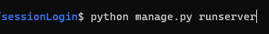
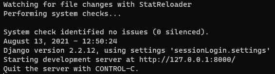
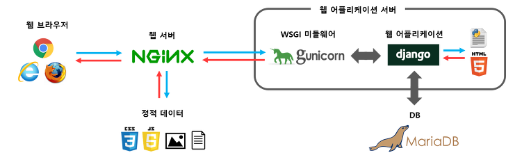
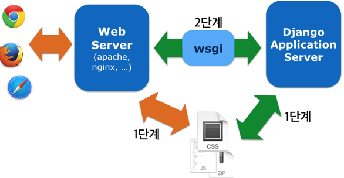
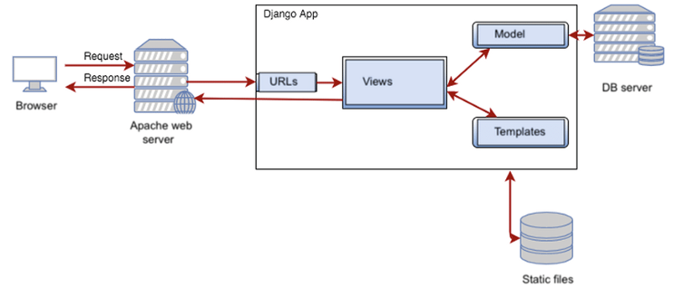
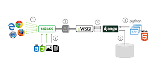

# 3주차 Django web 서버 적용 이해하기입니다.

목차

---

## 1. Django 서비스에 대한 정확한 이해

Django의 경우 프로젝트 폴더를 생성할 시 기본적으로 **manage.py**가 생성이 됩니다. 이 **manage.py**를 이용해서 **runserver**을 하게 되면 테스트용 개발 서버를 작동 시킬 수 있죠
  

이와 같은 역할 때문에 Django가 웹 서버의 역할까지 수행한다고 오해를 하는 경우 많습니다.

아래는 Django 공식 문서의 일부분 입니다.

> DO NOT USE THIS SERVER IN A PRODUCTION SETTING. It has not gone through security audits or performance tests. (We’re in the business of making Web frameworks, not Web servers, so improving this server to be able to handle a production environment is outside the scope of Django.) 이 서버를 프로덕션 세팅에서 사용하지마라. 이것은 보안 검수나 퍼포먼스 테스트를 통과하지 않았다. (**우리는 웹 서버를 만드려는게 아니고 웹 프레임워크를 만들었고**, 그렇기 때문에 프로덕션 환경에서 서버를 향상시키고 싶다면 **장고 외의 서버를 사용하라.**)

---

## 2. Django는 웹 프레임 워크입니다.

간단한 시진을 보겠습니다.  
  
위 사진에서 알 수 있듯 Django의 runserver의 기능은 개발을 편하게 하는데 중점을 두고 있고 웹 서버로 이용하기에는 적당하지 않습니다. **Django가 웹 프레임워크이지, 웹 서버가 이닌 이유입니다.**

> 자세히 보면 Django 구조는 web과 was를 복합해서 사용하고 있습니다. 사진으로 간단하게 표현을 하자면 다음과 같은 구조를 띄고 있습니다.  
>   
> 결론적으로 얘기를 하자면 was가 맞겠지만 애초에 서버를 중점으로 둔 것이 아니기 때문에 크게 신경쓸 필요는 없습니다. 따로 서버를 구축하는 것이 올바른 판단이죠

추가적으로 Django를 서버로 이용하면 안되는 이유가 한가지 더 있습니다. 아래 내용은 Django의 github에 있는 내용입니다.

> HTTP server that implements the Python WSGI protocol (PEP 333, rev 1.21).
> Based on wsgiref.simple_server which is part of the standard library since 2.5.
> This is a simple server for use in testing or debugging Django apps. It hasn't been reviewed for security issues. DON'T USE IT FOR PRODUCTION USE!  
> Python WSGI 프로토콜(PEP 333, rev 1.21)을 구현하는 HTTP 서버
> 2.5 이후 표준 라이브러리의 일부인 wsgiref.simple_server를 기반으로 한다.
> Django 앱을 테스트하거나 디버깅하는 데 사용할 수 있는 간단한 서버이다. **보안 문제에 대해서는 검토되지 않았다. 생산용으로 사용하지 마라!**

위 내용과 같이 runserver는 보안 이슈에 대해 체크하지 않았다고 합니다. 배포용으로 적당하지 않다는걸 얘기해주고 있습니다.

---

## 3. Django로 개발을 할 때면 어떻게 해야하나요?

Django를 이용한 웹 어플리케이션을 만들 때는 `gunicorn`이나 `uwsgi`와 같은 Gateway Interface를 통해서 다른 웹 서버 프로그램과 통신을 한다고 합니다. **(본 내용은 추가적으로 더 공부할 내용이고 나중에 더 살을 붙이도록 하겠습니다.)**

간단하게 웹 서버 프로그램들은 **정적인 자료들** 예를 들어 **CSS,Js,Img**를 처리합니다. **WAS(ex. WSGI)**에선 **동적인 데이터**를 처리한다고 합니다.

> 간단하게 가장 많이 사용하는 두가지 웹 서버 프로그램을 보겠습니다.
>
> - **APACHE(아파치)**  
>   **가장 전통적이며, 웹 서버의 점유율의 대부분을 가지고 있습니다.** 실제로 Django를 이용한 개발을 할 때 거의 대부분의 비율을 가지고 갑니다. 클라이언트의 요청 하나당 스레드 하나가 처리하는 구조로 요청이 많으면 그 만큼 스레드를 생성하여 메모리와 CPU소비량이 높습니다. 하지만 높은 점유율로 제공되는 모듈이 많고 호환성과 안전성이 뛰어납니다.  
>   
> - **NginX(엔진엑스)** > **점유율 2등의 프로그램입니다. 지속적으로 점유율이 상승하는 중입니다.** 비동기 이벤트 기반으로 요청을 처리합니다. 아파치보다 효율적으로 요청을 처리하지만 지원되는 모듈이 상대적으로 적다는 단점이 있습니다.  
>   

---

## 4. WSGI에 대한 이해

위 그림들을 보면 웹 서버 이후에 Django에 도달하기 전 거치는 과정이 한번 더 있습니다. 바로 WSGI입니다.  
**WSGI = Web Server Gateway Interface**  
WSGI는 Python Application이 Web server와 통신하기 위한 표준 Interface이며 Python Framework입니다. (지난 시간 얘기했던 프로토콜이라고 생각하시면 되겠습니다.)

> ### WSGI에 대한 이해를 위해 공식 문서를 간단히 인용해보겠습니다.
>
> WSGI는 서버와 게이트웨이 , 애플리케이션과 프레임워크 양단으로 나눠져 있다. WSGI 리퀘스트를 처리하려면, 서버단에서 환경정보와 콜백 함수를 애플리케이션단에 제공해야 한다. 애플리케이션은 그 요청을 처리하고 미리 제공된 콜백 함수를 통해 서버단에 응답한다. WSGI 미들웨어(라고 불린다.)가 WSGI 서버와 애플리케이션 사이를 보충해주는데, 이 미들웨어는 서버의 관점에서는 애플리케이션으로, 애플리케이션의 관점에서는 서버로 행동한다. 이 미들웨어는 다음과 같은 기능을 가진다.
>
> - 환경 변수가 바뀌면 타겟 URL에 따라서 리퀘스트의 경로를 지정해준다.
> - 같은 프로세스에서 여러 애플리케이션과 프레임워크가 실행되게 한다.
> - XSLT 스타일시트를 적용하는 것과 같이 전처리를 한다.

어렵게 설명을 했지만 대략적인 구조는 아래와 같습니다.

> **HTTP requests** -> **Web Server** -> **WSGI Server**(Middleware) -> **Django**(WSGI를 지원하는 Web Application)

WSGI의 예시로는 **gunicorn, mod_wsgi, uwsgi**가 있습니다. 이 중 gunicorn을 기준으로 잡겠습니다.

### 4-1 gunicorn에 대한 이해

gunicorn은 상대적으로 **빠르고 간단하며 사용이 쉽다**고 합니다. 아래 특징을 보겠습니다

1. WSGI, web2py, Django 그리고 Peter를 지원
2. **Automatic worker process management**
3. 간단한 Python configuration
4. **Multiple worker configuration**
5. 확장성(extensibility)을 위한 다양한 Server hook들
6. python2.6+ 그리고 python3.2+ 호환 가능

가장 중요하고 생각되는 2번과 4번을 보겠습니다. gunicorn은 master process와 worker process로 나뉩니다. gunicorn을 실행하게 되면 그 자체가 master process가 되고 설정에 부여된 worker 수대로 worker process가 생성 됩니다. 자세한 이해는 gunicorn 공식 페이지에서 확인할 수 있습니다. [gunicorn 공식 사이트](https://docs.gunicorn.org/en/stable/design.html)

### 4-2 Django에 적용하는 방법은?

Django의 기본 명령어인 runserver 명령은 setting.py에 WSGI APPLICATION에서 경로를 가져옵니다. 자세한 사항은 공식 사이트를 통해 확인할 수 있습니다. [WSGI APPLICATION 설정](https://docs.djangoproject.com/en/3.0/ref/settings/#std:setting-WSGI_APPLICATION)

공식 사이트의 내용과 같이 Django는 wsgi를 위한 모듈인 `wsgi.py`를 제공합니다. 내부 구현 변경 없이 gunicorn 서버를 선택할 수 있게 해주죠. WSGI 규칙에 맞는 웹 서버와 웹 어플리케이션을 어떻게 구현해야 하는지는 [PEP 3333](https://www.python.org/dev/peps/pep-3333/)에 자세히 나와 있습니다.
